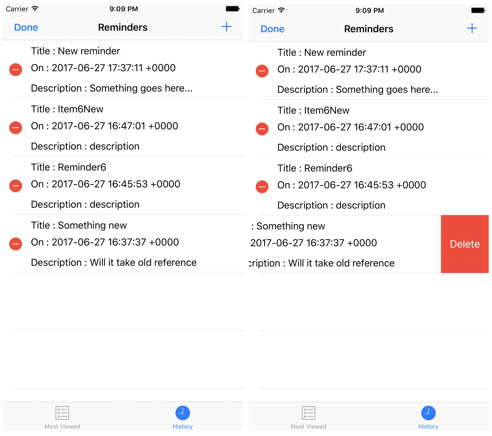

### Introduction:
&nbsp;&nbsp;&nbsp;&nbsp;&nbsp;&nbsp;This app follows the legacy of [TheReminderApp](https://github.com/rajagopal28/TheReminderApp), my first ever android project that I did with the main intention to learn android when it was becoming a huge hit. The old app is all about adding reminders, viewing them as a list and getting a fancy “android toast“ if you have any reminders for today. The main objective behind the app was to learn key things in android like activities, navigation, xml layouts and SQLite backend. The app was so naive and it was only developed by a rookie college kid who thinks who can code.
&nbsp;&nbsp;&nbsp;&nbsp;&nbsp;&nbsp;Coming to **iMindYou**, similar to the above app, this app is also designed with an intent to learn iOS development, aka Swift programming. With a very limited knowledge on iOS development and with a great fear on seeing objective C programming, I wanted to create a ver simple app with really simple use case. So I used the same concept and developed this application with the key learnings are determined as table views, tabbed view, list navigation, navigation buttons and their navigations, persistence using SQLite, behavior driven development using Quick and Nimble.
### Key Learnings and Technical nuances:
&nbsp;&nbsp;&nbsp;&nbsp;&nbsp;&nbsp;The key objective was to keep the first step in learning iOS development. Hence the app was not build to perfection, I myself have identified few key bugs, which I am intending to fix in the next phase of learning. Being new to Swift and having a little android experience had a little impact in the beginning as Swift is not so similar to Java, syntactically and behaviorally.
&nbsp;&nbsp;&nbsp;&nbsp;&nbsp;&nbsp;The most interesting programming aspects were Optionals and the way that nil values are handled around the app and yeah, it is nil and not null as in java 😛 . On one hand optionals help a lot in handling assignment on the member functions without complicated if checks and member function invocation in somewhat similar to the ternary operators, but on the other hand difficulties rose when dealing with actual initialization, assignment and declaration of objects as member variables and so on.
&nbsp;&nbsp;&nbsp;&nbsp;&nbsp;&nbsp;I had a peak at Objective C development and I felt like was lost left in an unknown dark world with a lot of wild animals 😛 I wondered how apple developers have gone to such an extreme in creating and working in such a tightly objectified language to an entirely new looking functional/ObjectOriented language.

- *Table views* are of great help. On comparing with their android counterparts, ListViews, TableViews have a lot of advantage especially in handling navigation, insertion, updating, deletion and their animations.
- *Built-in Date picker-scroll and ImagePicker* views are so developer friendly when compared to android in some aspects.
- *Navigations using navigation controllers* are smooth as cheese cakes while Android intent based navigations are not less effective either.
- *Embedding/combining Navigation controllers with Tabbed Controllers* complicates a lot of good stuffs.
- *Sequel, animation and presentation* as so straight forward with event based approaches and action handling mechanisms.
-  *SQLite* access is no way different from that of android. With the SQLite.swift wrapper it was so easy and fancy to work with database, queuing and manipulating the relational data.
- *UI tests* - For the first time I have written a full fledged automation test suit for the pet project using XCUITests. And damn it was so good to see your application run on its own, click on its own and change on its own like a magic. There were difficulties in identifying table view items which was solved by predicates, still the tests take a bad name when it comes to filling the text fields with given data, where autocorrects spoil the text and make the test fail 😔 .
- *Quick/Nimble* tests - Tried BDD with the models and there were a lot of integration tests sort of features when it comes to SQLite backend operations which I tried to cover in the UI tests. There were no unit testable logics as most of them were straight forward crud operations. Intending to use them more intensively in Phase II.
-
### Application walkthrough:
#### Home - Tabbed View & today’s reminder alert:

#### History Tab & Empty List View:

#### New Reminder View & Edit reminder View:

#### Edit List View and Delete Item:

### The known bugs:
&nbsp;&nbsp;&nbsp;&nbsp;&nbsp;&nbsp;The following are the few bugs I have noticed myself and I am intending to fix them as I continue the process of learning iOS development.
- Date time picker disabling for the edit reminders - On editing a past reminder the date displayed is the one that has been saved while we should disable or show error if the user tries to save the reminder with the old date.
- On Updating a reminder from past list and saving, the item gets added to the past list. This is because of  ``` reminders[selectedIndexPath.row] = reminder ``` in the save navigation to TableViewController.
- Popup being displayed based on the current tab enum being nil. Clean fix should replace this patch.
- The cancel flow for new reminder is patched at the code ```  let isPresentingInAddMode = presentingViewController != nil ``` while it should be ``` let isPresentingInAddMode = presentingViewController ```  is UINavigationController. The app failed to pick the Class check due to the embedding of TabbedViewContrller.

### The Future:
&nbsp;&nbsp;&nbsp;&nbsp;&nbsp;&nbsp;Apart from fixing the above bugs I also intend to make the app “Reminder” like by including alarm kind of features to notify the user on the specified time. Snoozing and other Reminder centric features.
### References:
&nbsp;&nbsp;&nbsp;&nbsp;&nbsp;&nbsp;The following are the references that helped me great time.
- Basics tutorial: https://developer.apple.com/library/content/referencelibrary/GettingStarted/DevelopiOSAppsSwift/BuildABasicUI.html#//apple_ref/doc/uid/TP40015214-CH5-SW1
- Quick&Nimble:  https://github.com/Quick/Quick/blob/master/Documentation/en-us/InstallingQuick.md
- SQLite:  https://github.com/stephencelis/SQLite.swift
- Carthage Documentation : https://github.com/Carthage/Carthage
- TabbedView Integration: https://makeapppie.com/2015/02/04/swift-swift-tutorials-passing-data-in-tab-bar-controllers/
